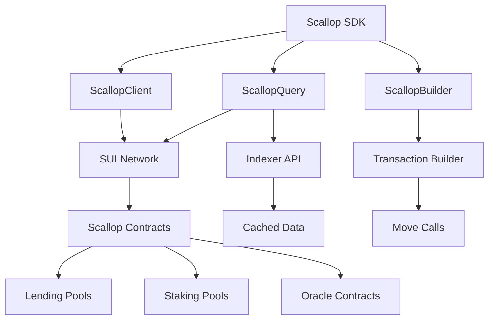

# Sui Scallop SDK 詳細分析

## 概要

sui-scallop-sdkは、SUIブロックチェーン上のScallopレンディングプロトコルと相互作用するための包括的なTypeScript SDKです。DeFiアプリケーション開発者がScallopプロトコルの全ての機能にアクセスできるよう設計されています。

## プロジェクト情報

- **バージョン**: 2.2.0
- **ライセンス**: Apache-2.0
- **開発者**: team@scallop.io
- **リポジトリ**: https://github.com/scallop-io/sui-scallop-sdk
- **対応ネットワーク**: メインネット（テストネットは部分的サポート）

## 技術スタック

### 主要依存関係
- **@mysten/sui**: 1.28.2 - SUI公式SDK
- **@pythnetwork/pyth-sui-js**: 2.1.0 - Pyth Oracle統合
- **@scallop-io/sui-kit**: 1.4.1 - SUIネットワークツールキット
- **@tanstack/query-core**: 5.59.16 - データフェッチング
- **axios**: ^1.9.0 - HTTP通信
- **bignumber.js**: ^9.1.2 - 数値計算
- **zod**: ^3.23.8 - スキーマ検証

### 開発ツール
- **TypeScript**: 5.5.4
- **Vitest**: 3.1.1 - テストフレームワーク
- **ESLint + Prettier**: コード品質管理
- **tsup**: 7.2.0 - ビルドツール
- **Husky**: 8.0.3 - Git hooks

## アーキテクチャ

### 7つの主要モデル

#### 1. Scallop - メインエントリーポイント
```typescript
const scallop = new Scallop({
  addressId: '67c44a103fe1b8c454eb9699',
  networkType: 'mainnet',
  secretKey: [secretKey]
});
```

**機能:**
- 全モデルの統合と初期化管理
- 単一インスタンスからの全機能アクセス
- 自動初期化とキャッシュ管理

#### 2. ScallopClient - コントラクト操作
```typescript
// 担保の入金
await scallop.client.depositCollateral('sui', 1000);

// 資産の借入
await scallop.client.borrow('wusdc', 500, true, obligationId, obligationKey);

// ステーキング
await scallop.client.stake('ssui', 1000);
```

**主要機能:**
- **レンディング操作**: 担保の入出金、資産の入出金、借入・返済
- **ステーキング操作**: ステーキング、アンステーキング、報酬請求
- **フラッシュローン**: 即座の借入と返済機能
- **VeSCA操作**: ベスティング機能とロック期間管理
- **借入インセンティブ**: 借入報酬の管理

#### 3. ScallopQuery - データクエリ
```typescript
// マーケットデータ取得
const marketData = await scallop.query.queryMarket();

// ユーザーポートフォリオ取得
const portfolio = await scallop.query.getUserPortfolio();

// 価格データ取得
const prices = await scallop.query.getCoinPricesByIndexer();
```

**主要機能:**
- **マーケットデータ**: プール、担保、金利情報の取得
- **ユーザーデータ**: 残高、借入状況、ポートフォリオ情報
- **価格データ**: Oracleからの価格取得
- **ステーキングデータ**: ステーキング状況と報酬情報
- **インデクサー統合**: API経由での高速データ取得

#### 4. ScallopBuilder - トランザクション構築
```typescript
const txBlock = scallop.builder.createTxBlock();
await txBlock.depositQuick(1000, 'sui');
await txBlock.stakeQuick(marketCoin, 'ssui', stakeAccount);
```

**主要機能:**
- **トランザクションブロック作成**: 複雑なトランザクションの構築
- **コイン選択**: 自動的なコイン選択とマージ機能
- **条件付き操作**: 複数の条件に基づくトランザクション実行

#### 5. ScallopAddress - アドレス管理
```typescript
// アドレス取得
const poolAddress = scallop.address.get('core.coins.sui.id');

// ネットワーク切り替え
scallop.address.switchCurrentAddresses('testnet');
```

**主要機能:**
- **コントラクトアドレス管理**: 全てのScallopコントラクトアドレス
- **ネットワーク対応**: メインネット、テストネット対応
- **API統合**: 動的なアドレス更新機能

#### 6. ScallopUtils - ユーティリティ
```typescript
// コインタイプ変換
const coinType = scallop.utils.parseCoinType('sui');
const sCoinName = scallop.utils.parseSCoinName('sui');

// 価格取得
const prices = await scallop.utils.getCoinPrices(['sui', 'wusdc']);

// APR/APY変換
const apy = scallop.utils.parseAprToApy(0.05, 365);
```

**主要機能:**
- **コインタイプ変換**: 各種コイン名とタイプの相互変換
- **価格取得**: 複数のOracleからの価格データ取得
- **数学計算**: APR/APY変換、ロック期間計算
- **コイン操作**: コイン選択、マージ、分割

#### 7. ScallopIndexer - インデクサーAPI
```typescript
// 高速データ取得
const coinPrices = await scallop.indexer.getCoinPrices();
const poolData = await scallop.indexer.getPoolData('sui');
```

**主要機能:**
- **高速データ取得**: RPCをバイパスした高速クエリ
- **集約データ**: 複雑な計算済みデータの提供
- **フォールバック機能**: API障害時のRPC自動切り替え

## サポートするアセット

### ネイティブ資産
- **SUI**: ネイティブトークン
- **afSUI**: Aftermath Financeのステーキングトークン
- **haSUI**: Haedal Protocolのステーキングトークン
- **vSUI**: Volo Protocolのステーキングトークン

### ブリッジ資産
- **wETH**: Ethereum Wrapped Ether
- **wBTC**: Wrapped Bitcoin
- **wUSDC**: USD Coin
- **wUSDT**: Tether USD
- **wSOL**: Wrapped Solana
- **CETUS**: Cetus DEXトークン

### カスタム資産
- **SCA**: Scallop Token（プロトコル独自トークン）

## Oracle統合

### 対応Oracle
1. **Pyth Network**: 高精度価格フィード
2. **Switchboard**: 分散型Oracle
3. **Supra**: 高速価格更新
4. **xOracle**: Scallop独自Oracle

### 価格取得戦略
```typescript
// 複数エンドポイントからの価格取得
const pythEndpoints = [
  'https://hermes.pyth.network',
  'https://scallop.rpc.p2p.world'
];

// フォールバック機能付き価格取得
const prices = await scallop.utils.getCoinPrices(['sui', 'wusdc']);
```

## 高度な機能

### フラッシュローン
```typescript
await scallop.client.flashLoan(
  'wusdc',
  10000,
  (txBlock, coin) => {
    // フラッシュローンのコールバック処理
    return txBlock.moveCall('some::arbitrage::execute', [coin]);
  }
);
```

### VeSCA（ベスティング）
```typescript
// VeSCAアカウント作成
const veScaKey = await scallop.client.createVeSca(1000, 365);

// ロック期間延長
await scallop.client.extendVeSca(veScaKey, 730);

// ロック解除
await scallop.client.redeemVeSca(veScaKey);
```

### 借入インセンティブ
```typescript
// 借入インセンティブのステーキング
await scallop.client.stakeObligation(obligationId, obligationKey);

// 報酬の請求
await scallop.client.claimBorrowIncentive(obligationId, obligationKey);
```

### リファラルシステム
```typescript
// リファラルコード生成
const referralCode = await scallop.builder.generateReferralCode();

// リファラル報酬の請求
await scallop.client.claimReferralRewards(referralCode);
```

## データフロー



## セキュリティ機能

### ウォレット統合
- 安全な秘密鍵管理
- HDウォレットサポート
- マルチアカウント管理

### トランザクション検証
- 事前検証機能
- ガス費計算
- 残高チェック

### エラーハンドリング
- 包括的なエラー処理
- 自動リトライ機能
- 詳細なエラーメッセージ

## パフォーマンス最適化

### キャッシュシステム
```typescript
// TanStack Queryによる効率的なキャッシュ
const queryClient = new QueryClient({
  defaultOptions: {
    queries: {
      staleTime: 30000,
      gcTime: 300000,
    },
  },
});
```

### 並列処理
- 複数API呼び出しの並列実行
- バッチ処理による効率化
- 非同期処理の最適化

### インデクサー統合
- RPC呼び出しの削減
- 集約データの提供
- リアルタイム更新

## 使用例

### 基本的なレンディング操作
```typescript
import { Scallop } from '@scallop-io/sui-scallop-sdk';

// SDK初期化
const scallop = new Scallop({
  addressId: '67c44a103fe1b8c454eb9699',
  networkType: 'mainnet',
  secretKey: [secretKey]
});

await scallop.init();

// 担保の入金
await scallop.client.depositCollateral('sui', 1000);

// 資産の借入
const obligation = await scallop.query.getObligations()[0];
await scallop.client.borrow(
  'wusdc', 
  500, 
  true, 
  obligation.id, 
  obligation.obligationKey
);

// ステーキング
await scallop.client.stake('ssui', 1000);

// ポートフォリオ情報の取得
const portfolio = await scallop.query.getUserPortfolio();
console.log('Total Value Locked:', portfolio.totalValueLocked);
```

### 高度な操作
```typescript
// フラッシュローンを使用したアービトラージ
await scallop.client.flashLoan(
  'wusdc',
  10000,
  async (txBlock, coin) => {
    // DEXでのスワップ
    const swappedCoin = txBlock.moveCall('dex::swap', [coin, 'sui']);
    
    // 利益の計算と返却
    const profit = txBlock.splitCoins(swappedCoin, [1000]);
    return profit;
  }
);

// VeSCAの作成と管理
const veScaKey = await scallop.client.createVeSca(1000, 365);
await scallop.client.extendVeSca(veScaKey, 730);

// 借入インセンティブの管理
await scallop.client.stakeObligation(obligation.id, obligation.obligationKey);
await scallop.client.claimBorrowIncentive(obligation.id, obligation.obligationKey);
```

## 開発とテスト

### テスト実行
```bash
# 単体テスト
pnpm run test:unit

# 統合テスト
pnpm run test:integration

# カバレッジテスト
pnpm run test:coverage
```

### ビルド
```bash
# 開発ビルド
pnpm run build

# ウォッチモード
pnpm run watch
```

### リンティング
```bash
# コードフォーマット
pnpm run format:fix

# リンティング
pnpm run lint:fix
```

## まとめ

sui-scallop-sdkは、Scallopプロトコルの全ての機能にアクセスできる包括的なツールキットです。7つの主要モデルが協調して動作し、レンディング、ステーキング、Oracle統合、高度なDeFi機能を提供します。

**主要な利点:**
- 包括的な機能セット
- 高いパフォーマンス
- 優れた開発者体験
- 強固なセキュリティ
- 豊富なドキュメント

このSDKを使用することで、開発者は複雑なDeFiアプリケーションを効率的に構築し、Scallopプロトコルの全ての機能を活用できます。
